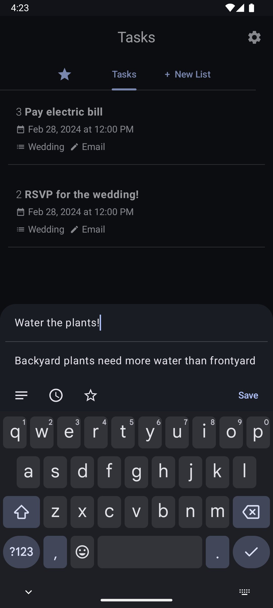
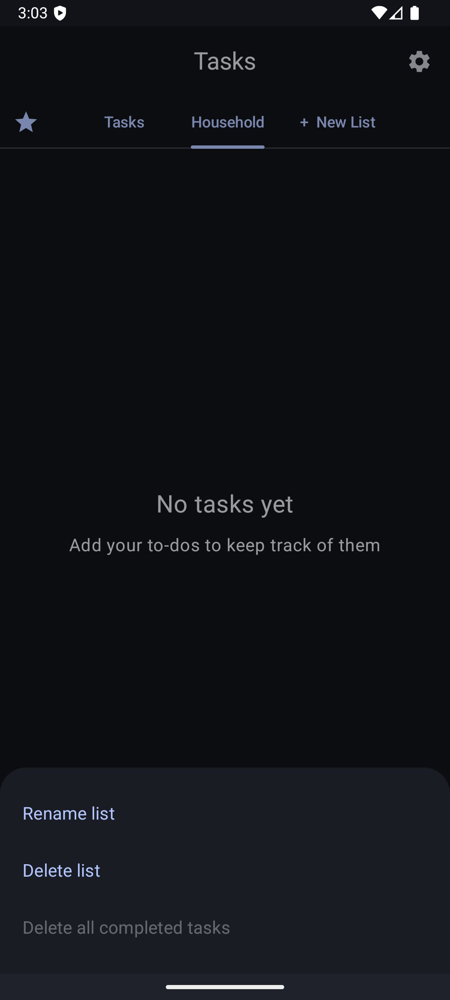
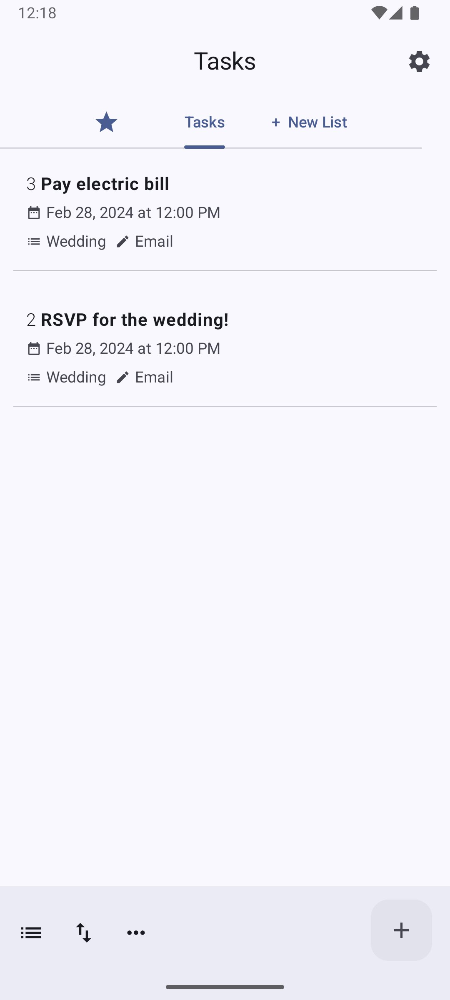

%% 

  <a class="obsidian-tile" href="projects/tasks.md" aria-label="Task Management - Android">
    
    
Task Management - Android

  </a>

  <a class="obsidian-tile" href="Page Three.md" aria-label="Open Page Three">
    
    
Page Three

  </a>

  <a class="obsidian-tile" href="https://example.com" aria-label="Go to Example dot com">
    
    
External Site

  </a>

 %%

<a class="obsidian-tile" href="projects/tasks.md" aria-label="View details about the Task Management app">
    
    
Task Management Android App

  </a>
  <a class="obsidian-tile" href="projects/bee.md" aria-label="View details about the Spelling Bee app">
    
    
Spelling Bee

  </a>
  <a class="obsidian-tile" href="Page Three.md" aria-label="Open Page Three">
    
    
Page Three

  </a>
  <!-- External link example -->
  <a class="obsidian-tile" href="https://example.com" aria-label="Go to Example dot com">
    
    
External Site

  </a>

