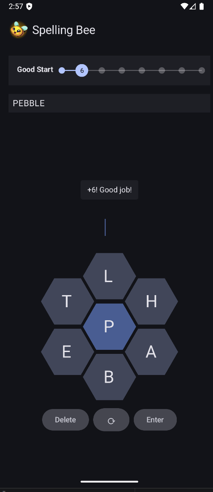

Hey, thanks for stopping by!

I am a software developer pursuing my Master's in Computer Science at Cal State Long Beach. I have had a passion for computers and programming since I was a kid. 

Outside the digital realm, I enjoy:

 - Tennis
 - Cooking
 - Reading (_Oathbringer_ by Brandon Sanderson)
 - Music, concerts, record collecting
 - Hiking
 
## Projects

Here are some projects I've worked on!

<a class="obsidian-tile" href="projects/tasks.md" aria-label="View details about the Task Management app">
    
    
Task Management Android App

  </a>
  <a class="obsidian-tile" href="projects/bee.md" aria-label="View details about the Spelling Bee app">
    
    
Spelling Bee

  </a>

