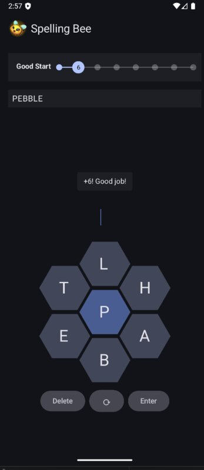

- Built using Jetpack Compose, following Material Design 3 patterns
- Wrote AWS Lambda functions to validate words against a dictionary

This project started in June 2025. My friends sucked me into the whole *New York Times* Wordle craze, and on their game app, they have a few other games, Spelling Bee being one of them.

It's an interesting puzzle game: given seven letters laid out in a honeycomb shape, try to spell as many words as you can that all contain the center letter. I wouldn't have started this project, except the *New York Times* decided that users could only play one or two words before being locked out, and prompted to purchase their six-dollar a month subscription! The programmer within me quickly dissected that this game would be tremendously simple to implement, and that I would feel silly paying $6 a month forever to play something that I could probably build in a couple days.  

 

<figure>

<figcaption>A user spelling the word 'pebble' from the available letters.</figcaption>
</figure>

