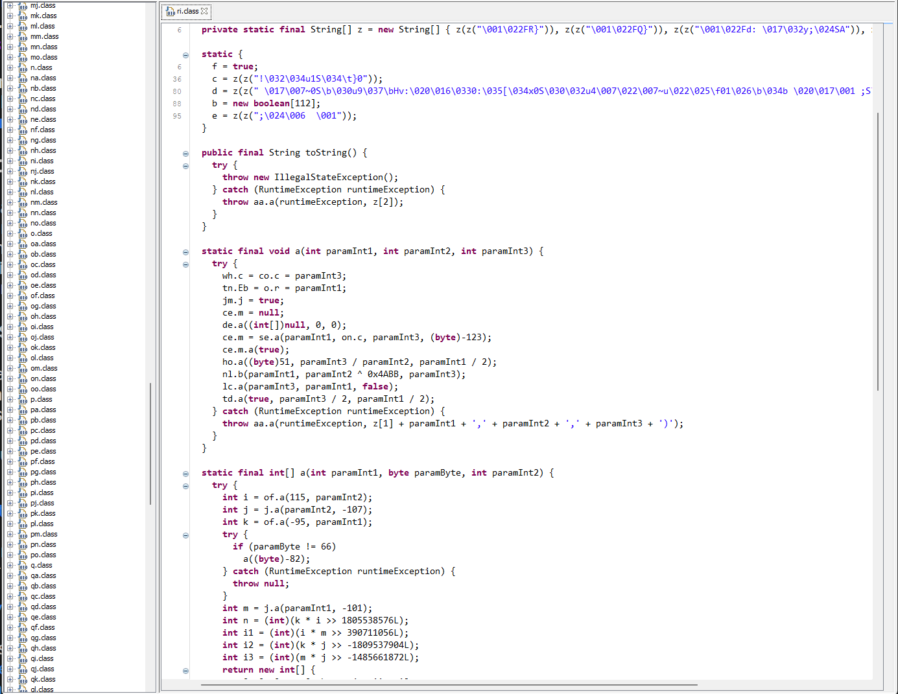
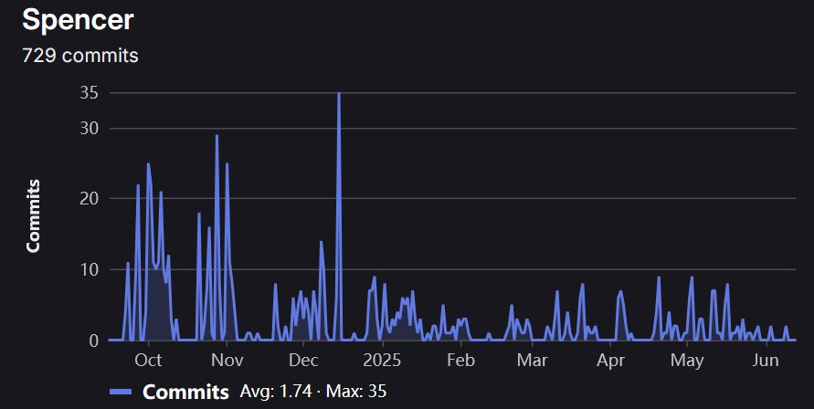

- Refactored an obfuscated Java game client, restoring readability for over 350 classes
- Reverse-engineered the networking protocol, documenting 60 different packets
- Built a custom server from scratch using [Netty](https://netty.io/) to accept these packets, restoring original online functionality

I embarked on this project because of all the fun I had playing an old Java-browser game called *Arcanists* as a young teen (Back when Java applets could load in browsers!)

Arcanists was a *tactical-artillery* style game, where players control a wizard. They choose a set of spells, then try to defeat their opponents in an arena! If you ever played the game [Worms](https://en.wikipedia.org/wiki/Worms_(1995_video_game)) from the mid-90s, this was basically a clone of it, but with wizards and magic instead!     

When I started this project in October 2024, I didn't expect much to come of it. It all started with a single Java executable, a heavily obfuscated .jar file of the *Arcanists* client shortly before the game went offline.

Here's a glimpse into the original code:

<figure style="text-align:center; margin: 1rem 2rem;">
  
  <figcaption><em>An example of the client's obfuscation.</em></figcaption>
</figure>

I was a bit discouraged to see that all Strings, ints and longs were somehow obfuscated, plus lots of annoyances like unnecessary "dummy" parameters, and other control flow modifications.  Fortunately, after a bit of research I discovered the exact company and product that was used to obfuscate the code! It turned out to be the work of [Zelix KlassMaster](https://www.zelix.com/klassmaster/features.html), an old obfuscation product from the early 2000s!

A couple of searches later led me to de-obfuscation programs targeted specifically for Zelix-KlassMaster, and suddenly, the project seemed much more reasonable!

The process of refactoring the codebase was pretty time-consuming, but I tried to approach it using a few strategies:

- Start refactoring from the execution point, and branch out.
- Focus on `java.net.Socket` objects to understand what kind of data is sent and received by the client.
- Look for specific Java library imports to deduce the functionality of a given class. 
  - If you see `javax.sound`, it's probably playing a sound file somehow. 
  - If it imports `java.zip.CRC32`, that's probably related to file verification, or the game's caching system!

Following these few techniques proved to be a very efficient way to refactor, and after a month or two I felt comfortable starting a server implementation. At the beginning, it was mostly trial-and-error, but eventually, I was able to make a simple connection!

<figure style="text-align:center; margin: 1rem 2rem;">
  <video
    class="video"
    controls
    preload="metadata"
    poster="../images/arc/poster.png"
    width="635" height="478"
  >
    <!-- MP4 is fine; add WebM too if you have it -->
    <source src="../images/arc/video.mp4" type="video/mp4">
    <a href="../images/arc/video.mp4">Here's a video of the first successful connection!</a>.
  </video>
  <figcaption><em>A video of the first successful connection!</em></figcaption>
</figure>

After I had a barebones server that could actually connect to clients, everything else started to fall into place. I decided to use MySQL to persist account data and other player state like leaderboard rankings, spell loadouts.

Here's a graph showing the repositories commits over time.

<figure style="text-align:center; margin: 1rem 2rem;">
  
  <figcaption><em>Commits made since starting the project.</em></figcaption>
</figure>

The most interesting aspect of this codebase was the way the game handles validation of a player's actions in an online match. At any given time, the client maintains a rolling checksum value, which is calculated whenever any game state changes. Periodically, this checksum is sent to the server. Initially, I wasn't sure why the server would need the checksum, but I after some thought, it made sense. 

The server was meant to take the match state, and create its own instance of the match. In a way, it's playing its own copy of the game in a secure, server-side environment. For example, if a player moves to the right, the server receives that command to move, executes it inside its copy of the match, then receives an expected checksum at the end. The clients send their "expected checksum" values to the server so the server can verify if everyone's in sync! Since the server is "playing the game" along with the clients, it serves as the source of truth if any of the clients deviate from the expected state.       

 

<figure>

<figcaption>An online match taking place between two clients.</figcaption>
</figure>
<figure>

<figcaption>A player casts the fireball spell.</figcaption>
</figure>

<figure>

<figcaption>Designed an algorithm to match players together given chosen constraints.</figcaption>
</figure>

