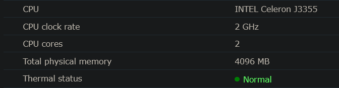

In 2018, I decided to start my self-hosting journey by picking up a Synology NAS, and four 12TB hard drives. Putting these drives in RAID-5 provided 1-disk redundancy, and 31.6TB of usable storage space across the four drives. Not too bad of a compromise in my book!

While this amount of storage might seem a bit extreme, I've always been a big proponent of data archival and preservation. Sites like [archive.org](https://archive.org/) prove that just because something is available on the Internet one day, doesn't mean it'll be available the next. The largest contributor to this disk space is a collection of Bluray disks that I've acquired over the years.

<figure style="text-align:center; margin: 1rem 2rem;">
  
  <figcaption><em>A sneak peak at this absolute powerhouse.</em></figcaption>
</figure>

While it's a lower-powered machine, it doesn't have to do very strenuous work, so the fact that it's running a dual-core Celeron hasn't been too much of a bottleneck. The processor has built-in media decoders, which Intel calls *QuickSync*, so it has decent performance when playing back the Bluray files on my TV, or when I'm out and about.

When I first got this server, I had a few goals and use-cases that I wanted to accomplish. My main objectives were:
- Have a machine that runs 24/7, with plenty of storage for my collection of movies and CDs.
- Have a place to backup and view my photos and videos from Google Photos, so I could stop using and paying for that every month.
- Run a CalDAV server to synchronize and store my phone's contacts and calendar events, so I could stop using Google Calendar and Contacts.
- Have a dedicated server that I could use to host my own websites and servers

All of these goals were fulfilled and then some! This thing has really come in handy over the years. I've used it to:
- Host a git server when I had to do team projects at school (unnecessary, but still fun!)
- Host my wedding website when I got married last year
- Host the game server I was [reverse-engineering recently](./reverse-engineered), and an SQL DB for it to connect to
- Host an Obsidian Sync server, to synchronize my notes across my phone and computer

To deploy and maintain these services, I chose Docker at the time because I wanted to learn more about it. The idea of being able to spin up reproducible virtual machines, create separate virtual networks to isolate or connect services, mounting local directories to pass data into the container, all of that just sounded so cool and powerful. It felt like a pretty reliable way to manage applications, and a great solution for the services I wanted to host.

So that's what I did, and it hasn't failed me yet. Running this server over the years has taught me a lot of useful things about Docker, virtualization in general, and server security best practices, especially when putting things onto the public Internet. On the security front, self-hosting helped me understand reverse proxies much better, port forwarding, firewall configuration, DNS, and more.